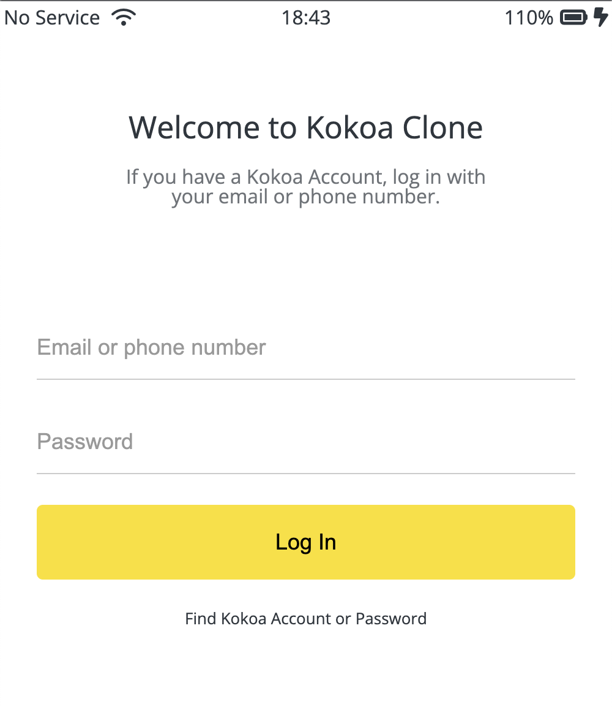
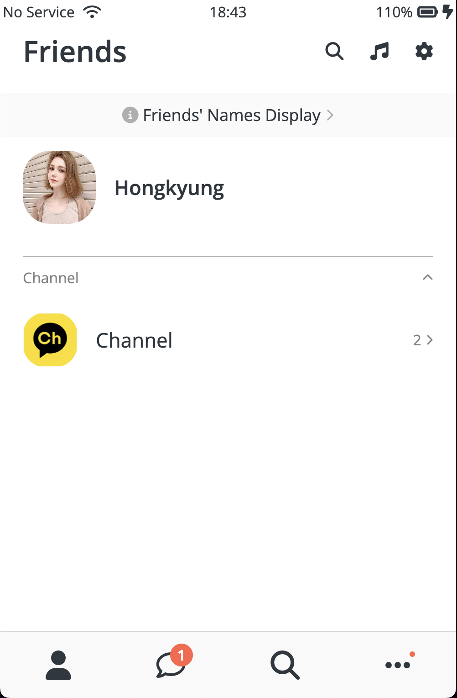
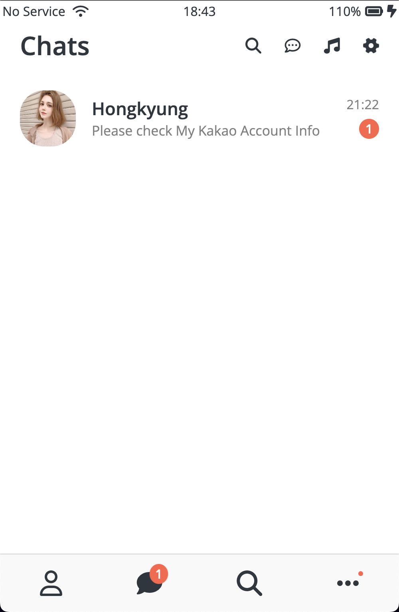
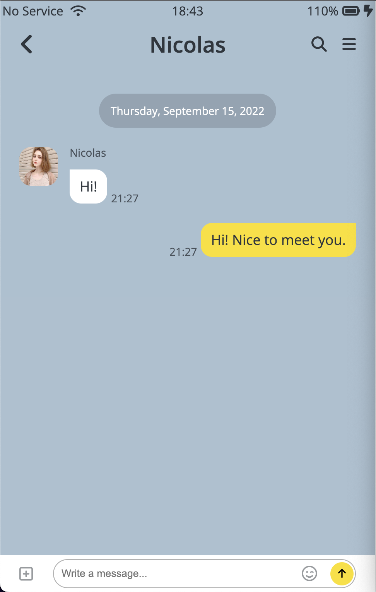
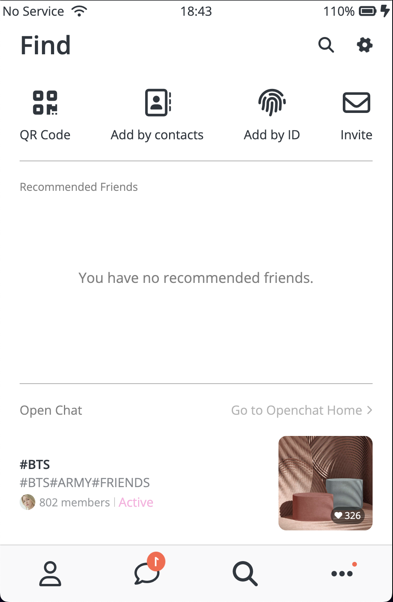
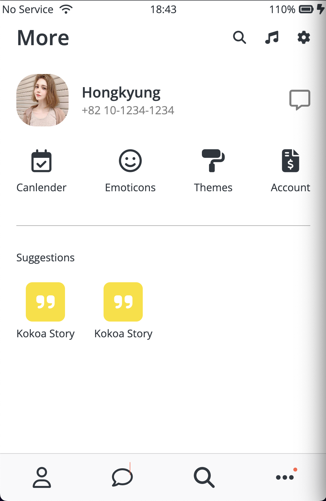
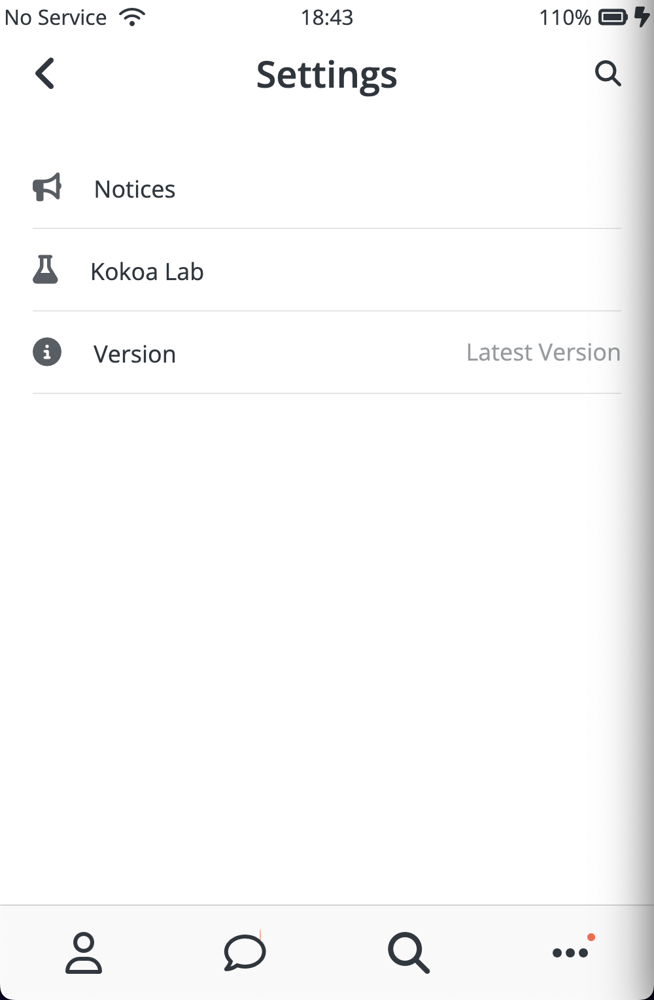

# Kokoa Clone 2022 update

> By nomad coder  
> vanila JS를 적용해서 카카오톡 클론하기

## 1. main structure

### 1-1. Login

### 1-2. Friends(친구목록)

### 1-3. chats(채팅)

### 1-4. chat(채팅창)

채팅창에서 메세지를 클릭하면 채팅창화면으로 링크된다.
  
< (뒤로가기) 버튼으로 채팅방에서 나가기.

### 1-5. find(검색)

### 1-6. more(더보기)

### 1-7. settings(설정)

---

## 2. Common structure

공통적으로 반복되는 부분을 개별 css를 만들어 모든 페이지에 적용하기.

### 2-1. status-bar

### 2-2. nav

